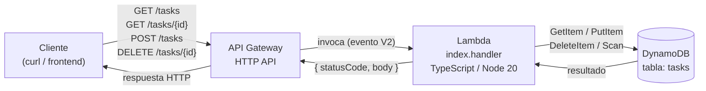

# API CRUD DynamoDB (TypeScript/Node)

**Objetivo:** API REST mínima (CRUD de tareas) sobre DynamoDB, expuesta vía API Gateway (HTTP API) y resuelta con una Lambda en TypeScript.
**Servicios AWS:** API Gateway (HTTP API), Lambda, DynamoDB, IAM, CloudWatch Logs
**Lenguaje:** TypeScript / Node.js 20 (bundleado con esbuild)
**Estado:** ✅ funcionando de punta a punta

## Arquitectura



Rol de IAM adjunto a la Lambda con permisos mínimos (`GetItem`, `PutItem`, `DeleteItem`, `Scan`) solo sobre la tabla `tasks` — ver `dynamodb-policy.json`.

## Estructura de datos

### Tabla DynamoDB `tasks`

Partition key: `id` (string). Sin sort key — cada tarea es un ítem independiente.

| Atributo | Tipo | Ejemplo | Notas |
|---|---|---|---|
| id | string | `e558c507-6074-...` | Generado por el servidor (`crypto.randomUUID()`), no lo manda el cliente |
| title | string | `aprender API Gateway` | Provisto por el cliente en el `POST` |
| done | boolean | `false` | Fijo en `false` al crear (sin endpoint de actualización en esta versión) |

### Rutas de la API

| Método | Ruta | Acción | Status éxito | Status error |
|---|---|---|---|---|
| GET | `/tasks` | Listar todas las tareas | 200 | — |
| GET | `/tasks/{id}` | Obtener una tarea | 200 | 404 si no existe |
| POST | `/tasks` | Crear una tarea (`{"title": "..."}` en el body) | 201 | 400 si falta el body |
| DELETE | `/tasks/{id}` | Borrar una tarea | 204 | — (idempotente: borrar algo inexistente también da 204) |

## Cómo correrlo

### 0. Instalar dependencias

```bash
npm install
```

Instala exactamente las versiones fijadas en `package-lock.json`.

### 1. Tests (sin tocar AWS)

```bash
npm run typecheck
npm test
```

6 tests con `vitest` + `aws-sdk-client-mock`, cubriendo los 4 métodos y sus casos de error, sin costo ni conexión real a DynamoDB.

### 2. Compilar

```bash
npm run build
```

Genera `dist/index.js` — un solo archivo bundleado (esbuild), sin el AWS SDK incluido (viene preinstalado en el runtime `nodejs20.x` de Lambda).

### 3. Infraestructura — tabla DynamoDB

```bash
aws dynamodb create-table \
  --table-name tasks \
  --attribute-definitions AttributeName=id,AttributeType=S \
  --key-schema AttributeName=id,KeyType=HASH \
  --billing-mode PAY_PER_REQUEST \
  --region us-east-1
```

Verifica que quedó activa:

```bash
aws dynamodb describe-table --table-name tasks --query 'Table.TableStatus' --output text
```

### 4. Infraestructura — rol de IAM para la Lambda

`trust-policy.json` y `dynamodb-policy.json` ya están en este repo (sin placeholders — a diferencia del build 01, el nombre de tabla `tasks` no es sensible ni único por cuenta, así que va hardcodeado).

```bash
aws iam create-role \
  --role-name aws-daily-builds-02-role \
  --assume-role-policy-document file://trust-policy.json

aws iam put-role-policy \
  --role-name aws-daily-builds-02-role \
  --policy-name aws-daily-builds-02-policy \
  --policy-document file://dynamodb-policy.json
```

### 5. Lambda

Empaqueta el bundle (solo `dist/index.js`, no `node_modules/`):

```bash
cd dist
zip ../lambda_function.zip index.js
cd ..
```

Crea la función (espera ~10-15s después del paso 4 por propagación de IAM):

```bash
ROLE_ARN=$(aws iam get-role --role-name aws-daily-builds-02-role --query 'Role.Arn' --output text)

aws lambda create-function \
  --function-name aws-daily-builds-02-tasks-api \
  --runtime nodejs20.x \
  --role "$ROLE_ARN" \
  --handler index.handler \
  --zip-file fileb://lambda_function.zip \
  --timeout 10 \
  --environment "Variables={TABLE_NAME=tasks}"
```

### 6. API Gateway (HTTP API)

Crea la API con integración directa a la Lambda:

```bash
FUNCTION_ARN=$(aws lambda get-function --function-name aws-daily-builds-02-tasks-api --query 'Configuration.FunctionArn' --output text)

aws apigatewayv2 create-api \
  --name aws-daily-builds-02-tasks-api \
  --protocol-type HTTP \
  --target "$FUNCTION_ARN"
```

Permiso para que API Gateway invoque la Lambda:

```bash
API_ID=$(aws apigatewayv2 get-apis --query "Items[?Name=='aws-daily-builds-02-tasks-api'].ApiId" --output text)
ACCOUNT_ID=$(aws sts get-caller-identity --query 'Account' --output text)

aws lambda add-permission \
  --function-name aws-daily-builds-02-tasks-api \
  --statement-id apigateway-invoke-permission \
  --action lambda:InvokeFunction \
  --principal apigateway.amazonaws.com \
  --source-arn "arn:aws:execute-api:us-east-1:${ACCOUNT_ID}:${API_ID}/*/*"
```

**Rutas explícitas** (ver Gotcha 2 abajo — el `--target` de `create-api` solo crea una ruta catch-all `$default` que no parsea `{id}`):

```bash
INTEGRATION_ID=$(aws apigatewayv2 get-integrations --api-id "$API_ID" --query 'Items[0].IntegrationId' --output text)

for route in "GET /tasks" "GET /tasks/{id}" "POST /tasks" "DELETE /tasks/{id}"; do
  aws apigatewayv2 create-route \
    --api-id "$API_ID" \
    --route-key "$route" \
    --target "integrations/$INTEGRATION_ID"
done
```

Obtén el endpoint público:

```bash
aws apigatewayv2 get-apis --query "Items[?Name=='aws-daily-builds-02-tasks-api'].ApiEndpoint" --output text
```

### 7. Probar

```bash
export API_URL="<tu-endpoint-de-arriba>"

# Crear
curl -X POST "$API_URL/tasks" -H "Content-Type: application/json" -d '{"title": "mi tarea"}'

# Listar
curl "$API_URL/tasks"

# Obtener una (usa el id que regresó el POST)
curl "$API_URL/tasks/<id>"

# Borrar
curl -X DELETE "$API_URL/tasks/<id>" -w "\nStatus: %{http_code}\n"
```

### 8. Limpieza

```bash
aws apigatewayv2 delete-api --api-id "$API_ID"
aws lambda delete-function --function-name aws-daily-builds-02-tasks-api
aws dynamodb delete-table --table-name tasks
aws iam delete-role-policy --role-name aws-daily-builds-02-role --policy-name aws-daily-builds-02-policy
aws iam delete-role --role-name aws-daily-builds-02-role
aws logs delete-log-group --log-group-name /aws/lambda/aws-daily-builds-02-tasks-api
```

## Notas

- Tabla en modo `PAY_PER_REQUEST` (on-demand) — sin capacidad fija que gestionar, cae dentro de los límites gratuitos para el volumen de pruebas de este build.
- Rol de IAM con permisos mínimos: solo `GetItem`, `PutItem`, `DeleteItem`, `Scan` sobre la tabla `tasks` específica — no `dynamodb:*`.
- `dist/`, `node_modules/` y `lambda_function.zip` son artefactos generados/instalados, ignorados por git. `package-lock.json` sí se versiona (reproducibilidad exacta de dependencias).
- Listar (`GET /tasks`) usa `ScanCommand` — lee toda la tabla, aceptable para este volumen de portafolio. En producción con datos a escala, se usaría `Query` sobre un índice o paginación con `ExclusiveStartKey`, no `Scan` completo.
- `DELETE` es idempotente: borrar un id inexistente también regresa `204`, porque DynamoDB no distingue "borré algo" de "no había nada que borrar" sin una llamada extra de verificación.
- **Gotcha 1:** `ScanCommand` existe en dos paquetes distintos del AWS SDK v3 (`@aws-sdk/client-dynamodb` y `@aws-sdk/lib-dynamodb`) con el mismo nombre pero como clases diferentes. Importarlo del paquete equivocado compila sin error (TypeScript no lo detecta) y corre sin error en Lambda real, pero rompe el mock en los tests (`aws-sdk-client-mock` no reconoce la clase y regresa `undefined`). Todos los comandos deben venir de `@aws-sdk/lib-dynamodb` (el DocumentClient), no del cliente crudo.
- **Gotcha 2:** `aws apigatewayv2 create-api --target <lambda-arn>` es un atajo que crea una única ruta catch-all (`$default`) que reenvía cualquier path tal cual, sin declarar qué segmentos son parámetros. Como resultado, `event.pathParameters` nunca se llena y cualquier lógica que dependa de `{id}` falla silenciosamente (cae a la rama equivocada del handler en vez de dar error). Hay que crear las rutas explícitas (`GET /tasks/{id}`, etc.) con `create-route` para que API Gateway parsee los parámetros de path correctamente.