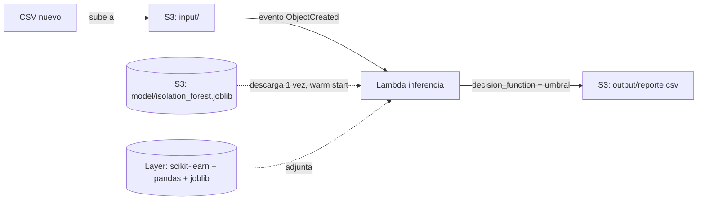

# Detección de anomalías en transacciones

**Objetivo:** detectar transacciones bancarias anómalas usando un modelo de Isolation Forest (scikit-learn) entrenado sobre el dataset de fraude de tarjetas de crédito, servido de forma serverless en AWS Lambda.

**Servicios AWS:** S3 (input/output/modelo/Layer), Lambda, IAM, CloudWatch Logs.

**Lenguaje:** Python

**Estado:** ✅ funcionando de punta a punta — probado con trigger automático de S3, sin invocación manual.

## Arquitectura



El modelo se entrena **fuera de AWS** (local, con `uv run train.py`) y solo el artefacto ya entrenado (`.joblib`) sube a S3 — separación clara entre entrenamiento e inferencia.

El nombre del bucket **no vive hardcodeado en el código** — la Lambda lo lee de la variable de entorno `MODEL_BUCKET`, configurada al crear/actualizar la función.

## Estructura de datos

**Dataset de entrenamiento:** [Credit Card Fraud Detection](https://www.kaggle.com/datasets/mlg-ulb/creditcardfraud) (ULB) — no se incluye en el repo (licencia "Other" no clara), se referencia por link. 284,807 transacciones, 492 fraudes reales.

**Features del modelo:** `V1`-`V28` (componentes PCA) + `Amount`, sin transformar (se probó log-transform, sin mejora medible, descartado — ver notebook de exploración).

**Artefacto serializado (`isolation_forest.joblib`):** diccionario con tres claves:
```python
{
    "modelo": IsolationForest,   # ya entrenado
    "umbral": float,             # 0.1624, calculado vía curva precision-recall + F1
    "features": list[str],       # V1-V28 + Amount, en el orden exacto usado al entrenar
}
```

**Reporte de salida:** CSV con las columnas originales + `score_anomalia` (continuo, más bajo = más anómalo) + `es_anomalia` (0/1), ordenado por severidad (más sospechosas primero).

## Cómo correrlo

**Importante — correr todo desde WSL nativo** (`/home/tu-usuario/...`), no desde una carpeta montada de Windows (`/mnt/c/...`). Ver gotcha de plataforma en Notas.

0. **Instalar dependencias:**
   ```bash
   uv sync
   ```

1. **Entrenar el modelo** (genera `isolation_forest.joblib`):
   ```bash
   uv run python/train.py
   ```

2. **Armar la Layer de dependencias:**
   ```bash
   uv pip install \
     --no-installer-metadata \
     --no-compile-bytecode \
     --python-platform x86_64-manylinux_2_28 \
     --python 3.13 \
     --prefix packages \
     scikit-learn==1.9.0 joblib==1.5.3 pandas==3.0.5

   # Verificar ANTES de empaquetar — debe verse "lib/python3.13/site-packages" (minúscula, con versión)
   find packages/lib -maxdepth 2

   mkdir -p layer/python
   cp -r packages/lib layer/python/

   find layer/python -type d \( -name "tests" -o -name "test" \) -exec rm -rf {} + 2>/dev/null
   find layer/python -type d -name "__pycache__" -exec rm -rf {} + 2>/dev/null

   cd layer && zip -r ../layer_content.zip python && cd ..
   ```

3. **Crear el bucket y subir modelo + Layer:**
   ```bash
   BUCKET=__BUCKET_NAME__

   aws s3 mb s3://$BUCKET
   aws s3 cp isolation_forest.joblib s3://$BUCKET/model/isolation_forest.joblib
   aws s3 cp layer_content.zip s3://$BUCKET/layers/layer_content.zip
   ```

4. **Publicar la Layer:**
   ```bash
   aws lambda publish-layer-version \
     --layer-name sklearn-anomaly-detection \
     --content S3Bucket=$BUCKET,S3Key=layers/layer_content.zip \
     --compatible-runtimes python3.13 \
     --compatible-architectures x86_64

   LAYER_ARN=$(aws lambda list-layer-versions --layer-name sklearn-anomaly-detection --query 'LayerVersions[0].LayerVersionArn' --output text)
   ```

5. **Rol IAM** (reusa `trust-policy.json` del build 1; genera `lambda-policy.json` real a partir de `lambda-policy.template.json` con `sed`):
   ```bash
   aws iam create-role \
     --role-name anomaly-detection-lambda-role \
     --assume-role-policy-document file://trust-policy.json

   sed "s|__BUCKET_NAME__|$BUCKET|g" lambda-policy.template.json > lambda-policy.json

   aws iam put-role-policy \
     --role-name anomaly-detection-lambda-role \
     --policy-name anomaly-detection-s3-access \
     --policy-document file://lambda-policy.json
   ```

6. **Empaquetar y crear la Lambda** (nota el `--environment` — es lo que le pasa `MODEL_BUCKET` a la función, sin hardcodearlo en el código):
   ```bash
   ACCOUNT_ID=$(aws sts get-caller-identity --query Account --output text)

   cd python && zip function.zip lambda_function.py && cd ..

   aws lambda create-function \
     --function-name anomaly-detection-inference \
     --runtime python3.13 \
     --role arn:aws:iam::$ACCOUNT_ID:role/anomaly-detection-lambda-role \
     --handler lambda_function.lambda_handler \
     --zip-file fileb://python/function.zip \
     --layers $LAYER_ARN \
     --timeout 30 \
     --memory-size 512 \
     --environment "Variables={MODEL_BUCKET=$BUCKET}"
   ```

7. **Conectar el trigger de S3** (permiso + notificación; genera `notification.json` real a partir de `notification.template.json` con `sed`):
   ```bash
   aws lambda add-permission \
     --function-name anomaly-detection-inference \
     --statement-id s3-trigger-permission \
     --action lambda:InvokeFunction \
     --principal s3.amazonaws.com \
     --source-arn arn:aws:s3:::$BUCKET

   FUNCTION_ARN="arn:aws:lambda:us-east-1:$ACCOUNT_ID:function:anomaly-detection-inference"
   sed "s|__FUNCTION_ARN__|$FUNCTION_ARN|g" notification.template.json > notification.json

   aws s3api put-bucket-notification-configuration \
     --bucket $BUCKET \
     --notification-configuration file://notification.json
   ```

8. **Probar:** sube un CSV a `input/` y revisa que el reporte aparezca solo en `output/` (sin invocar nada manual):
   ```bash
   aws s3 cp tu_csv_de_prueba.csv s3://$BUCKET/input/tu_csv_de_prueba.csv
   aws s3 ls s3://$BUCKET/output/
   ```

9. **Limpieza:**
   ```bash
   aws lambda delete-function --function-name anomaly-detection-inference
   aws lambda delete-layer-version --layer-name sklearn-anomaly-detection --version-number __N__
   aws s3 rm s3://$BUCKET --recursive
   aws s3 rb s3://$BUCKET
   aws iam delete-role-policy --role-name anomaly-detection-lambda-role --policy-name anomaly-detection-s3-access
   aws iam delete-role --role-name anomaly-detection-lambda-role
   ```

## Notas

- **Gotcha — versión de scikit-learn y etiqueta de plataforma:** `scikit-learn==1.9.0` solo publica wheels para la etiqueta `manylinux_2_28`, no `manylinux2014` (versiones ≤1.7.2 son las últimas con esa etiqueta vieja). Instalar cruzando de Windows/WSL a Linux requiere especificar la etiqueta correcta (`--python-platform x86_64-manylinux_2_28` en `uv pip install`).
- **Gotcha — el `uv` de Windows puede "colarse" dentro de una terminal WSL:** si el proyecto vive en una carpeta montada de Windows (`/mnt/c/...`) y `uv` está instalado tanto en Windows como en WSL, `which uv` desde WSL puede resolver al `.exe` de Windows sin ningún aviso. El síntoma es sutil: la instalación *parece* funcionar, pero genera la estructura de carpetas con convención de Windows (`Lib/site-packages`, sin subcarpeta de versión) en vez de la de Linux (`lib/pythonX.Y/site-packages`) — y Lambda no puede importar nada aunque el `.zip` se vea "completo". Solución de raíz: mover el proyecto al filesystem nativo de WSL (`/home/usuario/...`, no `/mnt/c/...`) e instalar `uv` ahí directamente (`curl -LsSf https://astral.sh/uv/install.sh | sh`). Verificar siempre con `find packages/lib -maxdepth 2` antes de empaquetar — debe mostrar `lib/python3.13/site-packages`, no `Lib/site-packages`.
- **Gotcha — estructura de una Lambda Layer:** usa `--prefix` (no `--target`) al instalar con `uv pip install`, y el `.zip` debe tener `python/` como carpeta raíz — distinto al empaquetado de una función normal.
- **Límite de tamaño:** Lambda permite 250 MB descomprimidos entre código + todas las Layers. La instalación inicial pesaba 241 MB; remover carpetas `tests/`/`__pycache__` la bajó a 195 MB.
- **Gotcha — consistencia de versiones entre entrenamiento e inferencia:** el artefacto `.joblib` es sensible a la versión exacta de scikit-learn. La Layer fija `scikit-learn==1.9.0` idéntico al de `train.py`, para evitar errores de deserialización o resultados silenciosamente incorrectos.
- **El umbral de decisión no es `contamination`:** se entrena con el default y se calcula un umbral óptimo después, vía `precision_recall_curve` + maximización de F1 sobre `decision_function()`. Ese umbral se guarda junto con el modelo y las features en el mismo `.joblib`.
- **Gotcha — el permiso de invocación es independiente del rol de ejecución:** el rol IAM (`anomaly-detection-lambda-role`) le dice a la Lambda qué puede hacer ella; `aws lambda add-permission` es un mecanismo aparte que le dice a Lambda quién tiene permiso de invocarla desde afuera (en este caso, S3, y solo desde el bucket específico vía `--source-arn`).
- **Gotcha — el filtro de prefijo en la notificación no es opcional:** sin `Filter.Key.FilterRules` limitando el trigger a `input/`, cualquier escritura al bucket (incluyendo el propio reporte que la Lambda escribe en `output/`) dispararía la función de nuevo — riesgo real de loop infinito y costo descontrolado.
- **Gotcha — no hardcodear el nombre del bucket en el código:** la primera versión de `lambda_function.py` tenía `MODEL_BUCKET = "nombre-fijo"` escrito directo en el archivo. Al recrear el bucket con otro nombre (por ejemplo, para quitar datos personales del nombre), la función quedó apuntando a un bucket que ya no existía — un 404 confuso en el cold start. Solución: leer el bucket de una variable de entorno (`MODEL_BUCKET = os.environ["MODEL_BUCKET"]`), configurada vía `--environment "Variables={MODEL_BUCKET=...}"` al crear/actualizar la función. Así, cambiar de bucket solo requiere actualizar la configuración de la Lambda, nunca tocar ni redesplegar el código.
- **Rendimiento medido en la prueba real** (CSV de 20 filas): cold start (`Init Duration`) ~6.3-6.5s (carga de scikit-learn/pandas desde la Layer + descarga y deserialización del modelo); ejecución del handler ya con todo cargado (`Duration`) ~220-240 ms; memoria usada ~300 MB de los 512 MB asignados. Consistente entre corridas distintas.
- **Warning esperado en logs:** `joblib will operate in serial mode` — Lambda no tiene el recurso (`/dev/shm`) que `joblib` usa para paralelizar por default, así que cae a modo serial automáticamente. No afecta el resultado; irrelevante para el volumen de datos de este build.
- **`lambda-policy.json` y `notification.json` (reales) están excluidos del repo vía `.gitignore`** — contienen el nombre real del bucket y el ARN completo (que incluye el Account ID). Solo se versionan sus plantillas (`.template.json`).
- **Exploración completa del modelo** (intentos con distintos `contamination`, prueba de log-transform descartada, curva precision-recall) documentada en `create-model/notebooks/creation-model.ipynb`.