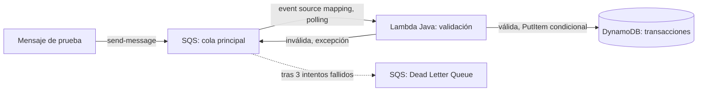

# Conciliación de transacciones por lotes (SQS + Lambda + DynamoDB)

**Objetivo:** procesar transacciones que llegan por una cola SQS, validarlas, y escribirlas de forma idempotente en DynamoDB — con reintentos automáticos y una Dead Letter Queue para mensajes que fallan repetidamente.

**Servicios AWS:** SQS (cola principal + DLQ), Lambda (Java 21), DynamoDB, IAM, CloudWatch Logs.

**Lenguaje:** Java 21 (Maven)

**Infraestructura:** Terraform — primer build del repo desplegado así; builds 01-03 se mantienen en AWS CLI puro por decisión explícita.

**Estado:** ✅ funcionando de punta a punta — probado procesamiento normal, idempotencia contra duplicados, y migración a DLQ tras 3 reintentos fallidos.

## Arquitectura



A diferencia de los builds 01/03 (trigger de S3, que requiere un permiso explícito `add-permission`), SQS funciona por **polling** — Lambda le pregunta a la cola si hay mensajes, en vez de que la cola le avise. No hace falta ningún permiso de invocación aparte del rol de ejecución.

## Estructura de datos

**Mensaje esperado en la cola** (JSON):
```json
{
  "id_transaccion": "TXN-00123",
  "cuenta": "ACC-9981",
  "monto": 450.00,
  "tipo": "deposito"
}
```

**Reglas de validación:** `id_transaccion` y `cuenta` no vacíos; `monto` numérico y mayor a 0; `tipo` en `{deposito, retiro, transferencia}`.

**Tabla DynamoDB (`batch-reconciliation-transacciones`):** partition key `id_transaccion` (string), `PAY_PER_REQUEST`. Escritura vía `PutItem` con `conditionExpression: attribute_not_exists(id_transaccion)` — si el ítem ya existe, la escritura falla a propósito y se captura como duplicado ignorado, sin romper la ejecución ni disparar un reintento innecesario.

## Cómo correrlo

0. **Instalar JDK 21 y Maven** (vía SDKMAN, no `apt` — más control de versiones):
   ```bash
   curl -s "https://get.sdkman.io" | bash
   source "$HOME/.sdkman/bin/sdkman-init.sh"
   sdk install java 21.0.12+1.1-tem   # Temurin; el sufijo/versión exacta puede variar, confirmar con: sdk list java | grep tem
   sdk install maven
   ```

1. **Compilar y empaquetar** (genera el "fat jar" con todas las dependencias, vía `maven-shade-plugin`):
   ```bash
   mvn clean package
   ```
   El jar final queda en `target/reconciliation-handler.jar` (~16 MB).

2. **Instalar Terraform** (si no está ya instalado):
   ```bash
   wget -O - https://apt.releases.hashicorp.com/gpg | sudo gpg --dearmor -o /usr/share/keyrings/hashicorp-archive-keyring.gpg
   echo "deb [signed-by=/usr/share/keyrings/hashicorp-archive-keyring.gpg] https://apt.releases.hashicorp.com $(lsb_release -cs) main" | sudo tee /etc/apt/sources.list.d/hashicorp.list
   sudo apt update && sudo apt install terraform -y
   ```

3. **Desplegar infraestructura:**
   ```bash
   cd terraform
   terraform init
   terraform plan    # revisar antes de aplicar — debe mostrar 7 recursos a crear
   terraform apply
   ```
   Los `outputs` regresan directamente las URLs de ambas colas y el nombre de la tabla — no hace falta ir a buscarlos a la consola.

4. **Probar — mensaje válido:**
   ```bash
   QUEUE_URL=$(terraform output -raw queue_url)
   aws sqs send-message --queue-url $QUEUE_URL --message-body '{"id_transaccion": "TXN-001", "cuenta": "ACC-9981", "monto": 450.00, "tipo": "deposito"}'
   aws dynamodb scan --table-name batch-reconciliation-transacciones
   ```

5. **Probar — idempotencia** (mandar el mismo mensaje otra vez, el conteo no debe cambiar):
   ```bash
   aws sqs send-message --queue-url $QUEUE_URL --message-body '{"id_transaccion": "TXN-001", ...}'
   aws dynamodb scan --table-name batch-reconciliation-transacciones --select COUNT
   ```

6. **Probar — validación y DLQ** (monto negativo, esperar ~3 min a que agote los 3 reintentos):
   ```bash
   aws sqs send-message --queue-url $QUEUE_URL --message-body '{"id_transaccion": "TXN-002", "cuenta": "ACC-9982", "monto": -50, "tipo": "deposito"}'
   DLQ_URL=$(terraform output -raw dlq_url)
   aws sqs receive-message --queue-url $DLQ_URL
   ```

7. **Limpieza:**
   ```bash
   terraform destroy
   ```

## Notas

- **Java no era un lenguaje nuevo** — el reto real de este build fue el contrato específico de Lambda (`RequestHandler<T, R>`), el SDK v2 de AWS, y Terraform, no la sintaxis del lenguaje en sí.
- **Gotcha — instalar JDK/Maven vía SDKMAN, no `apt`:** los repos de Ubuntu suelen ir varias versiones atrás, y gestionar múltiples JDKs con `apt` es incómodo. SDKMAN permite instalar y cambiar de versión limpiamente (equivalente a `uv`/`nvm` para el ecosistema JVM). La distribución del JDK (Temurin, Corretto, etc.) no afecta compatibilidad — el bytecode es portable entre distribuciones del mismo nivel de versión, a diferencia de lo que pasaba con scikit-learn en Python.
- **Gotcha — `RequestHandler` no permite declarar `throws` en la implementación:** el compilador rechaza `public Void handleRequest(...) throws Exception` porque la interfaz original no lo contempla. La solución correcta es capturar la excepción con `try/catch` dentro del método, no propagarla en la firma.
- **Diseño — excepciones separadas para cada tipo de fallo:** `JsonProcessingException` (JSON mal formado) y `TransaccionInvalidaException` (JSON válido pero reglas de negocio incumplidas, excepción propia) se capturan por separado — ambas relanzan para que la invocación falle y SQS reintente, pero quedan diferenciadas en los logs.
- **Gotcha — nombre del jar tras `shade-plugin`:** Maven genera primero un jar "flaco" (`original-*.jar`, solo el código propio) y uno temporal internamente durante el shading, pero al terminar lo renombra al `<finalName>` configurado en el `pom.xml` (`reconciliation-handler.jar`). El log de Maven puede parecer confuso ("Replacing X with Y") pero el resultado final sí respeta el nombre esperado por `terraform/main.tf`.
- **Warning esperado en logs:** `SLF4J: Failed to load class "StaticLoggerBinder"` — `slf4j-api` llega como dependencia transitiva del SDK de AWS sin una implementación de logging real detrás. No afecta el logging propio vía `context.getLogger()`.
- **Artefacto generado a excluir del repo:** `dependency-reduced-pom.xml`, creado automáticamente por `maven-shade-plugin` en la raíz del proyecto durante `mvn package` — se regenera en cada build, no debe versionarse (mismo criterio que `target/`).
- **`aws_lambda_event_source_mapping` (SQS) vs. trigger de S3 (build 01/03):** SQS funciona por polling, no requiere el paso de `add-permission` que sí es necesario para que S3 invoque una Lambda vía notificación push.
- **`.terraform.lock.hcl` sí se versiona** (a diferencia de `.terraform/` y `*.tfstate*`) — fija la versión exacta del provider de AWS y sus hashes de verificación, mismo criterio que `uv.lock`/`package-lock.json` en builds anteriores.
- **Cambio de convención de paquete:** se usó `com.portfolio.reconciliation` en vez de `com.cristian.reconciliation` — el groupId/paquete Java es puramente interno al código (nunca se expone como recurso público, a diferencia del nombre de un bucket S3), así que no hay problema real de privacidad en usar el nombre propio; se cambió por preferencia de consistencia del portafolio.